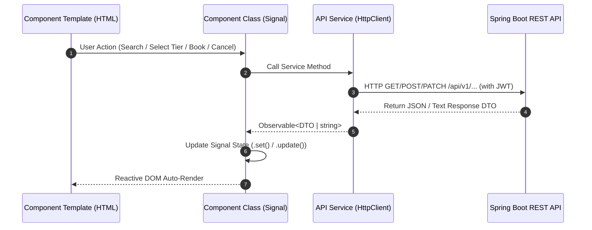

# 🎬 Phase 3: Feature Modules & User Workflows

## 🎯 Overview
This document details the end-to-end user workflows, feature component designs, digital QR code pass generation, booking cancellation architecture, and backend API integration layers across Customer, Organizer, and Admin portals.

---

## 1. Customer Workflow: Discovery to Digital Pass & Cancellation

```
Discover Page (Catalog Search & Filter)
       │
       ▼
Movie Details Page (Showtimes & Synopses)
       │
       ▼
Booking Page (Seat Category Tier & Concurrency Lock)
       │
       ▼
"My Tickets" Portal (Aggregated Bookings, Digital Pass QR Modal & Cancellation)
```

### 🍿 A. Movie Catalog & Discovery (`Discover.ts`)
- Fetches active movie listings from `/api/public/events`.
- Features real-time search filtering by movie title, genre selection pills, and smooth grid layout rendering.

### 🎟️ B. Seat Selection & Concurrency (`BookingPage.ts`)
- Displays real-time seat tier cards (**Standard: 120 EGP**, **VIP: 200 EGP**, **IMAX: 280 EGP**).
- Validates real-time seat availability (`availableSeats`).
- Submits booking request `POST /api/bookings`.
- **Overbooking Guard:** If two users attempt to book the last available seats simultaneously:
  1. Backend pessimistic database lock (`FOR UPDATE`) processes User A's transaction first.
  2. User B's request receives `HTTP 409 Conflict`.
  3. Frontend catches `409 Conflict`, displays error message `"Sorry, there are not enough seats available for this request."`, and immediately re-fetches event details to update seat availability to 0 without freezing the application.

### 📱 C. Master Booking Cards & QR Digital Pass (`MyTickets.ts`)
- **Data Aggregation (`groupTicketDtos`):** Instead of cluttering the UI with separate ticket cards when a user books multiple seats, tickets are aggregated by transaction into a single **Master Booking Card**.
- **Digital Pass Modal Drawer:** Clicking "View Gate Pass" or "View All Passes" opens an interactive modal drawer displaying individual vector QR codes generated dynamically via `angularx-qrcode`:
  ```html
  <qrcode [qrdata]="currentPass().ticketCode" [width]="200" [errorCorrectionLevel]="'M'" [elementType]="'svg'"></qrcode>
  ```
- Each pass displays unique ticket numbers (e.g. `TKN-8F92A1-1`), seat category details, tear-away stub cutouts (`.stub-notch`), and stepper controls (`Pass 1 of 3`).

### ❌ D. QR Booking Cancellation Workflow (`cancelBooking`)
- **User Action:** Customer selects "Cancel Booking" on an active reservation card in the `/my-tickets` portal.
- **Confirmation Guard:** Angular Material `ConfirmDialogComponent` opens to request explicit confirmation ("Are you sure you want to cancel your booking for [Movie Title]?").
- **API Call & Response Handling:** Upon confirmation, `TicketService.cancelBooking(bookingId)` sends a `PATCH /api/bookings/{bookingId}/cancel` request using plain-text response handling (`responseType: 'text'`) to prevent JSON parsing errors from string responses.
- **Backend State Update:** Backend marks the booking status as `CANCELLED` and restores the booked seat count back to the seat category's available capacity.
- **Frontend Reactive Reload:** Frontend triggers `loadTickets()`, reloading server state and reactively moving the card from **Active Reservations** to **Past Reservations** with a `CANCELLED` badge, while preserving QR code pass history for auditing.

---

## 2. Organizer & Admin Workflows

### 🎬 Organizer Portal (`/organizer`)
- **Dashboard (`Dashboard.ts`):** Overview of published events, seat capacity progress bars, total revenue metrics, and quick action buttons.
- **Event Editor (`EventEditor.ts`):** Form for creating or updating events, poster image URLs, showtimes, venues, and custom seat pricing tiers.
- **Attendee Roster (`Attendees.ts`):** Real-time table listing checked-in users, booked ticket numbers, and booking dates for a specific event.

### 🛡️ Admin Portal (`/admin`)
- **Admin Dashboard (`AdminDashboardComponent.ts`):** Executive overview of system statistics:
  - Total System Revenue
  - Total Events & Tickets Sold
  - Platform User Roster (Customers, Organizers, Admins)
  - Management tables to promote/demote user roles or delete events.

---

## 3. Data Flow Architecture (API Services ➔ Signals ➔ UI)



1. **Service Layer (`TicketService`, `EventService`, `AuthService`):** Handles raw `HttpClient` requests and returns RxJS Observables emitting strongly typed TypeScript DTOs.
2. **Component Layer:** Subscribes to service methods and writes response payloads directly into Angular Signals (`this.rawTickets.set(data)`).
3. **Template Layer:** Angular's Change Detection mechanism detects Signal updates and updates only the specific affected DOM elements with zero unnecessary re-renders.
